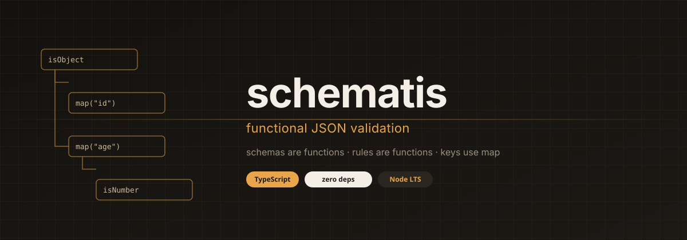

<p align="center">
  
</p>

<p align="center">
  <strong>functional JSON validation</strong><br/>
  schemas are functions · rules are functions · keys use <code>map</code>
</p>

<p align="center">
  
  
  
  
</p>

# schematis

Zero dependencies. TypeScript. Node LTS.

```ts
import { map } from 'schematis/tool'
import { isObject, isString, isNumber } from 'schematis/types'
import { hasMin } from 'schematis/rules'

const user = isObject(
  map('id', isString()),
  map('age', isNumber(hasMin(0))),
)

const { isValid, assert, getParsed, getErrors } = user({
  id: '42',
  age: 35,
})
```

A schema returns a **check**: `isValid()`, `assert()`, `getParsed()`, `getErrors()`. Values are required until `isOptional()`.

## Install

```
npm install schematis
```

Named exports from `schematis`, or from `schematis/types`, `schematis/rules`, `schematis/tool`.

## Docs

Function reference: [arielpchara.github.io/schematis](https://arielpchara.github.io/schematis/)

- [Types](https://arielpchara.github.io/schematis/types.html) — `isString`, `isObject`, `isUnion`, …
- [Rules](https://arielpchara.github.io/schematis/rules.html) — `isOptional`, `hasMin`, `isEmail`, …
- [Tools](https://arielpchara.github.io/schematis/tools.html) — `map`, `transform`, `refine`, `strict`, …
- [Core](https://arielpchara.github.io/schematis/core.html) — check object, pipeline, internals

## License

MIT
